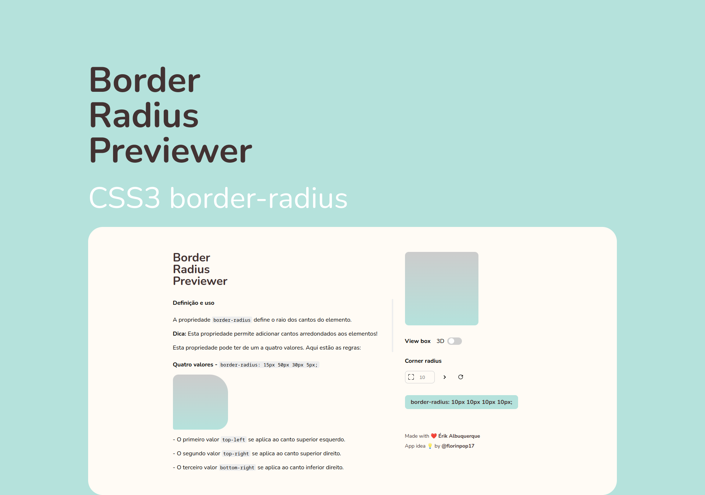
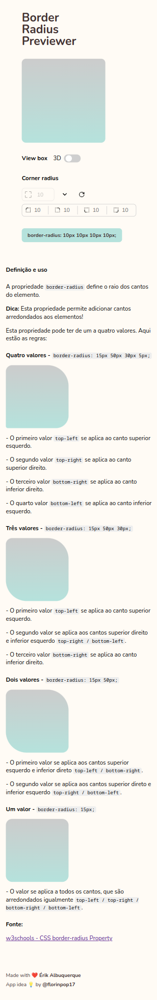
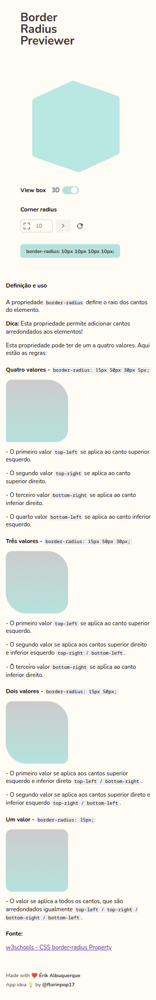
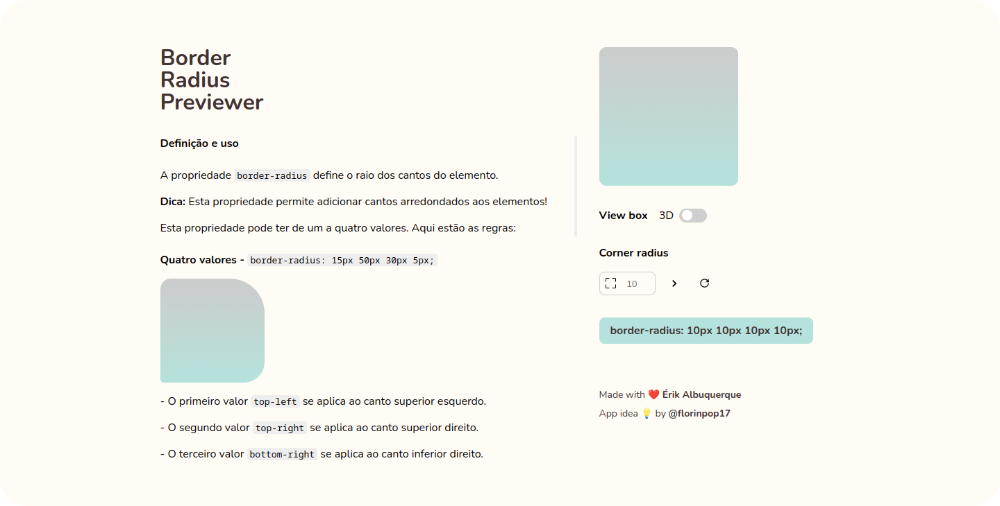

<h1 align="center" id="project_name">
  <br />
  
  <br />
</h1>

<p align="center">
Esta ferramenta pode ser usada para gerar efeitos CSS3 border-radius.
</p>

<p align="center">
  <!-- GitHub last commit -->
  <a href="https://github.com/erik-albuquerque/border_radius_previewer/commits/main">
    
  </a>
  <!-- GitHub language count -->
  
  <!-- GitHub top language -->
  
  <!-- Repository version -->
  
  <!-- Repository size -->
  
  <!-- Repository status -->
  
  <!-- Contribution -->
  
  <!-- Link repo -->
  <a href="https://github.com/erik-albuquerque/border_radius_previewer/blob/main/LICENSE.md">
    
  </a>
</p>

<p align="center">
 <a href="#about">Sobre</a> •
 <a href="#layout">Layout</a> • 
 <a href="#technologies">Tecnologias</a> • 
 <a href="#prerequisites">Pré-requisitos</a> •
 <a href="#contributors">Contribuidores</a> • 
 <a href="#author">Autor</a> • 
 <a href="#license">Licença</a>
</p>

<p align="center">
  
</p>

<h4 align="center">
  	🚧 Border Radius Previewer | Concluído 🚧
</h4>

<h2 id="about">
💻 Sobre o projeto
</h2>
Border Radius Previewer é um site simple e moderno. Seu proposito é gerar efeitos CSS3 border-radius.
<br />

Ref [App-ideas](https://github.com/florinpop17/app-ideas/blob/master/Projects/1-Beginner/Border-Radius-Previewer.md) by [@florinpop17](https://github.com/florinpop17)

<h2 id="layout">🎨 Layout</h2>

### Mobile (Responsivo)

<p align="center">
  

  
</p>

### Web

<p align="center" style="display: flex; align-items: flex-start; justify-content: center;">
  
</p>

<br />
<h2 id="technologies">🛠 Tecnologias</h2>

As seguintes ferramentas foram usadas na construção do projeto:

- **[React](https://reactjs.org/)**
- **[TypeScript](https://www.typescriptlang.org/)**
- **[styled-components](https://styled-components.com/)**

> Veja o arquivo [package.json](package.json)

**Utilitários**

- Modelo 3d: **[Threejs](https://threejs.org/)**
- Responsividade com styled-components: **[styled-breakpoints](https://github.com/mg901/styled-breakpoints#readme)**
- Editor: **[Visual Studio Code](https://code.visualstudio.com/)**
- Ícones: **[React Icons](https://react-icons.github.io/react-icons/)**
- Fontes: **[Nunito](https://fonts.google.com/specimen/Nunito)**

<h2 id="prerequisites">💿 Como executar o projeto</h2>

### 🧰 Pré-requisitos

Antes de começar, você vai precisar ter instalado em sua máquina as seguintes ferramentas:

> [Git](https://git-scm.com), [Node.js](https://nodejs.org/en/) ou [Yarn](https://yarnpkg.com/) se for sua preferência.
> Além disto é bom ter um editor para trabalhar com o código como [VSCode](https://code.visualstudio.com/)

### 🧭 Rodando o projeto

```bash
# Clone este repositório
$ git clone https://github.com/erik-albuquerque/border_radius_previewer.git

# Acesse a pasta do projeto no terminal/cmd
$ cd border_radius_previewer

# Instale as dependências (npm ou yarn)
$ yarn

# Execute a aplicação em modo de desenvolvimento
$ yarn dev

# acesse http://localhost:3000
```

<h2 id="contributors">📫 Como contribuir para o projeto</h2>

1.  Faça um **fork** do projeto.
2.  Crie um branch: `git checkout -b <nome_branch>`.
3.  Faça suas alterações e confirme-as: `git commit -m '<mensagem_commit>'`.
4.  Envie para a branch original: `git push origin <nome_branch>`.
5.  Crie a solicitação pull.

> Como alternativa, consulte a documentação do GitHub em [como criar uma solicitação pull](https://help.github.com/en/github/collaborating-with-issues-and-pull-requests/creating-a-pull-request)

## 👨‍💻 Contribuidores

Agradecemos às seguintes pessoas que contribuíram para este projeto:

<table>
  <tr>
    <td align="center">
      <a href="#">
        <!----><br>
        <sub>
          <b></b>
        </sub>
      </a>
    </td>
  </tr>
</table>

### 🙋‍♂️ Seja um dos contribuidores

Quer fazer parte desse projeto? Clique [AQUI](CONTRIBUTING.md) e leia como contribuir.

<h2 id="author">🦸 Autor</h2>
<a href="https://github.com/erik-albuquerque">
 
 <br />
 <sub><b>Érik Albuquerque</b></sub></a>

[](https://www.linkedin.com/in/erik-albuquerque/)
[](mailto:erik.albuquerque.oficial@gmail.com)

<h2 id="license">📝 Licença</h2>

Distribuído sob a licença MIT. Veja a [LICENSE](LICENSE) para mais informações.

Feito com ❤️ por Érik Albuquerque 👋🏽 [Entre em contato!](https://www.linkedin.com/in/erik-albuquerque/)

[⬆ Voltar ao topo](#project_name)<br />
